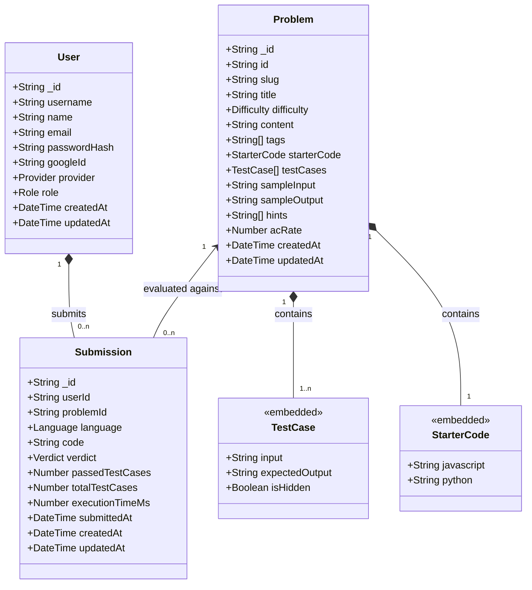
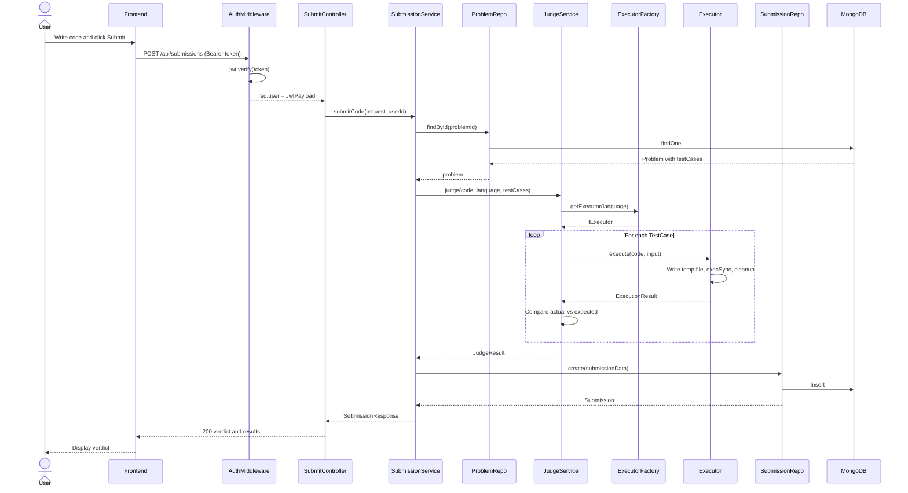
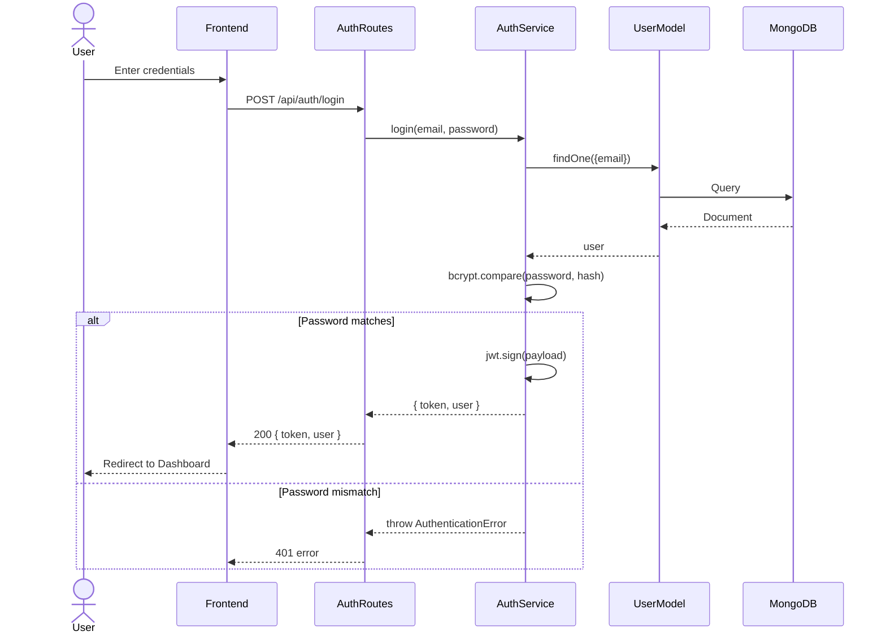
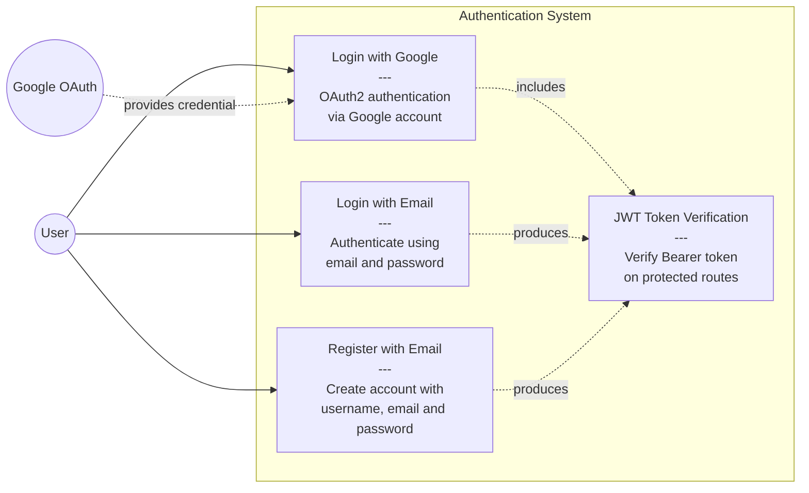
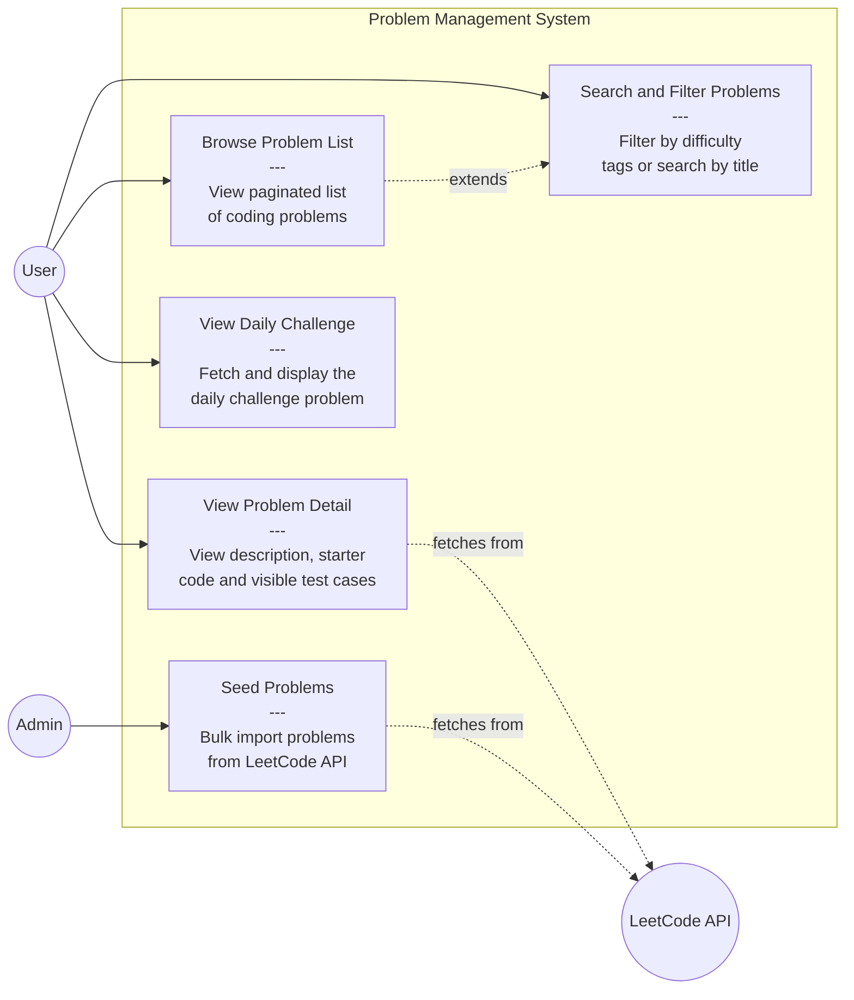
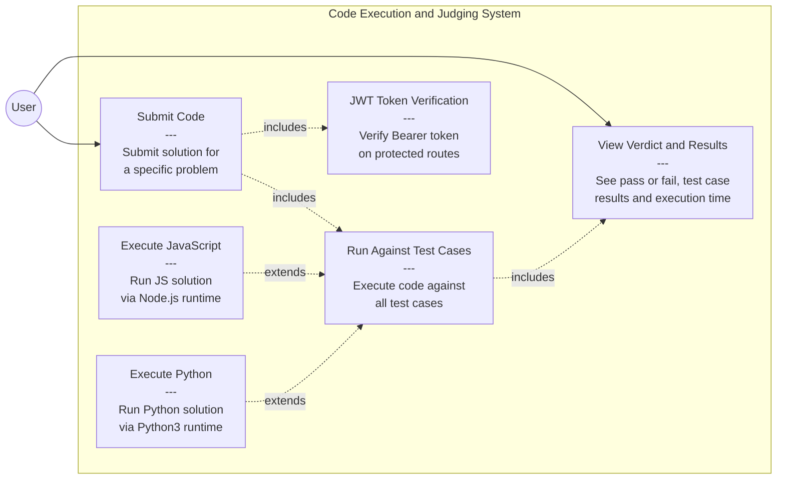
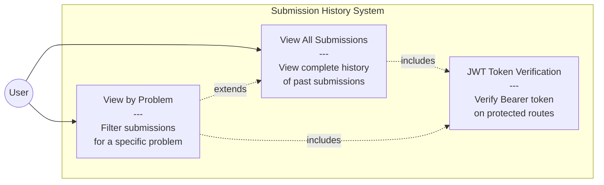

# Nexorithm -- Online Judge Platform

A full-stack competitive programming platform built with React, Express, TypeScript, and MongoDB. Users can browse LeetCode-style coding problems, write solutions in an integrated Monaco code editor, submit code for automated judging against test cases, and track their submission history.

---

## Table of Contents

- [Architecture](#architecture)
- [Tech Stack](#tech-stack)
- [Project Structure](#project-structure)
- [Database Design](#database-design) -- click to expand class diagram
- [Workflow](#workflow) -- click to expand sequence diagrams
- [Use Cases](#use-cases) -- click to expand use case diagrams
- [Design Patterns](#design-patterns) -- click to expand with code examples
- [OOP Concepts](#oop-concepts) -- click to expand with code examples
- [SOLID Principles](#solid-principles) -- click to expand with code examples
- [API Endpoints](#api-endpoints) -- click to expand
- [Getting Started](#getting-started)
- [Environment Variables](#environment-variables)

---

## Architecture

```
+-------------------------------------------------------------+
|                     Frontend (React + Vite)                  |
|  +-----------+  +----------+  +--------------------------+  |
|  | Problem   |  | Monaco   |  |  Console / Test Cases    |  |
|  | Panel     |  | Editor   |  |  (Verdict + Results)     |  |
|  +-----------+  +----------+  +--------------------------+  |
|  Context + useReducer | React Router DOM | DOMPurify        |
+---------------------------+---------------------------------+
                            | REST API (fetch)
                            v
+-------------------------------------------------------------+
|                Backend (Express + TypeScript)                |
|  +------------+  +----------------+  +------------------+   |
|  | Controllers|->|    Services    |->|  Repositories    |   |
|  | (HTTP)     |  | (Business)     |  | (Data Access)    |   |
|  +------------+  +----------------+  +------------------+   |
|                                                             |
|  JudgeService --> ExecutorFactory --> child_process.execSync |
|  ProblemService --> Tier 1/2 Fallback Chain                  |
|  AuthService --> bcrypt + JWT + Google OAuth                 |
+---------------------------+---------------------------------+
                            |
                            v
+-------------------------------------------------------------+
|                  MongoDB (Mongoose ODM)                      |
|  Users | Problems | Submissions                              |
|  (or In-Memory Mock Repositories for dev)                    |
+-------------------------------------------------------------+
```

---

## Tech Stack

| Layer | Technology |
|---|---|
| Frontend | React 18, TypeScript, Vite, Monaco Editor |
| Styling | Vanilla CSS with Custom Properties |
| State Management | React Context + useReducer |
| Routing | react-router-dom |
| Backend | Node.js, Express 5, TypeScript |
| Database | MongoDB with Mongoose ODM |
| Authentication | JWT + bcryptjs + Google OAuth2 |
| Code Execution | child_process.execSync (sandboxed, with timeout) |
| External API | Vercel LeetCode Proxy (Tier 1) + LeetCode GraphQL (Tier 2) |
| Containerization | Docker, Docker Compose |
| CI/CD | GitHub Actions (Docker Hub push on main) |
| Load Testing | k6 |

---

## Project Structure

```
Nexorithm/
|
|-- Backend/
|   |-- Dockerfile
|   |-- package.json
|   |-- tsconfig.json
|   +-- src/
|       |-- index.ts                        # Entry point, DI wiring
|       |-- api/
|       |   +-- external/
|       |       +-- LeetCodeApiClient.ts     # External API adapter
|       |-- config/
|       |   |-- index.ts                     # Environment config loader
|       |   +-- database.ts                  # MongoDB connection (Singleton)
|       |-- controllers/
|       |   |-- problem.controller.ts        # Problem HTTP handlers
|       |   +-- submit.controller.ts         # Submission HTTP handlers
|       |-- data/
|       |   +-- seedProblems.ts              # 20 built-in seed problems
|       |-- errors/
|       |   +-- AppError.ts                  # Error class hierarchy
|       |-- interfaces/
|       |   |-- IExecutor.ts                 # Executor interface
|       |   |-- IExternalProblemApi.ts        # External API interface
|       |   |-- IProblemRepository.ts         # Problem repository interface
|       |   +-- ISubmissionRepository.ts      # Submission repository interface
|       |-- middleware/
|       |   |-- auth.middleware.ts            # JWT authentication
|       |   +-- errorHandler.ts              # Global error handler
|       |-- models/
|       |   |-- User.model.ts                # User Mongoose schema
|       |   |-- Problem.model.ts             # Problem Mongoose schema
|       |   +-- Submission.model.ts          # Submission Mongoose schema
|       |-- repositories/
|       |   |-- MockProblemRepository.ts      # In-memory problem store
|       |   |-- MockSubmissionRepository.ts   # In-memory submission store
|       |   |-- MongoProblemRepository.ts     # MongoDB problem queries
|       |   +-- MongoSubmissionRepository.ts  # MongoDB submission queries
|       |-- routes/
|       |   |-- auth.routes.ts               # /api/auth routes
|       |   |-- problem.routes.ts            # /api/problems routes
|       |   +-- submit.routes.ts             # /api/submissions routes
|       |-- services/
|       |   |-- auth.service.ts              # Registration, login, Google OAuth
|       |   |-- judge.service.ts             # Test case judging engine
|       |   |-- problem.service.ts           # Problem CRUD + external fetch
|       |   |-- submission.service.ts        # Submission orchestration
|       |   +-- executorFactory.ts           # Factory + Template Method executors
|       +-- types/
|           +-- index.ts                     # Enums, interfaces, DTOs
|
|-- Frontend/
|   |-- Dockerfile
|   |-- package.json
|   |-- vite.config.ts
|   +-- src/
|       |-- App.tsx                          # Root component with routing
|       |-- main.tsx                         # Entry point
|       |-- index.css                        # Global styles
|       |-- api/                             # Backend API client functions
|       |-- components/
|       |   |-- Workspace/                   # 3-panel code editor workspace
|       |   |-- ProblemList/                 # Problem dashboard grid
|       |   |-- Layout/                      # Header, navigation
|       |   +-- common/                      # VerdictBadge, Modal, shared UI
|       |-- context/                         # WorkspaceContext (useReducer)
|       |-- hooks/                           # Custom React hooks
|       |-- pages/                           # Page-level components
|       |-- styles/                          # Editor theme configuration
|       +-- types/                           # Frontend TypeScript types
|
|-- diagrams/
|   |-- class_diagram.md                     # Database class diagram (Mermaid)
|   |-- sequence_diagram.md                  # Sequence diagrams (Mermaid)
|   +-- usecase_diagram.md                   # Use case diagrams (Mermaid)
|
|-- .github/
|   +-- workflows/
|       +-- docker.yml                       # CI/CD pipeline
|
|-- docker-compose.yml
|-- k6-loadtest.js                           # Load testing script
+-- README.md
```

---

## Class Diagram

<details>
<summary><strong>Click to expand -- Class Diagram and Schema</strong></summary>
<br>

The application uses three MongoDB collections via Mongoose ODM.



### Enum Definitions

```sql
CREATE TYPE Role       AS ENUM ('user', 'admin');
CREATE TYPE Provider   AS ENUM ('local', 'google');
CREATE TYPE Difficulty AS ENUM ('easy', 'medium', 'hard');
CREATE TYPE Language   AS ENUM ('javascript', 'python');
CREATE TYPE Verdict    AS ENUM ('Accepted', 'Wrong Answer', 'Runtime Error',
                                'Time Limit Exceeded', 'Compile Error');
```

</details>

---

## Workflow

<details>
<summary><strong>Click to expand -- Sequence Diagrams</strong></summary>
<br>

### Code Submission Flow



### Authentication Flow



</details>

---

## Use Cases

<details>
<summary><strong>Click to expand -- Use Case Diagrams</strong></summary>
<br>

### 1. Authentication Use Cases



### 2. Problem Management Use Cases



### 3. Code Execution and Judging Use Cases



### 4. Submission History Use Cases



### Actor Summary

| Actor | Type | Role |
|---|---|---|
| User | Primary | Solves problems, submits code, views history |
| Admin | Primary | Seeds and manages problem database |
| Google OAuth | External | Provides OAuth2 credential for authentication |
| LeetCode API | External | Source for problem data via Vercel proxy and GraphQL |

</details>

---

## Design Patterns

<details>
<summary><strong>Click to expand -- 5 Design Patterns with Code</strong></summary>
<br>

### 1. Factory Pattern

**Where:** `ExecutorFactory` class in `Backend/src/services/executorFactory.ts`

**Purpose:** Creates language-specific executor instances without exposing instantiation logic.

```typescript
// ExecutorFactory maintains a registry of executors
export class ExecutorFactory {
  private static readonly executors: Map<Language, IExecutor> = new Map([
    [Language.JAVASCRIPT, new JavascriptExecutor()],
    [Language.PYTHON, new PythonExecutor()],
  ]);

  static getExecutor(language: Language): IExecutor {
    const executor = this.executors.get(language);
    if (!executor) {
      throw new AppError(`Unsupported language: ${language}`, 400);
    }
    return executor;
  }
}
```

**Usage in** `Backend/src/services/judge.service.ts`:

```typescript
const executor = ExecutorFactory.getExecutor(language); // Factory call
const execResult = await executor.execute(code, tc.input); // Strategy call
```

---

### 2. Template Method Pattern

**Where:** `BaseExecutor` abstract class in `Backend/src/services/executorFactory.ts`

**Purpose:** Defines the skeleton of the code execution algorithm while letting subclasses override specific steps.

```typescript
abstract class BaseExecutor implements IExecutor {
  // Template method - defines the algorithm skeleton
  async execute(code: string, input: string, timeoutMs = 5000): Promise<ExecutionResult> {
    const filePath = path.join('/tmp', `nexorithm-${uuidv4()}.${this.getFileExtension()}`);
    try {
      fs.writeFileSync(filePath, code, 'utf8');
      const command = this.getCommand(filePath);    // Deferred to subclass
      const stdout = execSync(command, { input, timeout: timeoutMs });
      return { stdout, stderr: '', exitCode: 0, timedOut: false };
    } finally {
      fs.unlinkSync(filePath);                      // Cleanup always runs
    }
  }

  // Abstract steps that subclasses must implement
  protected abstract getCommand(filePath: string): string;
  protected abstract getFileExtension(): string;
}
```

**Subclass implementations:**

```typescript
// JavaScript executor
export class JavascriptExecutor extends BaseExecutor {
  protected getCommand(filePath: string): string { return `node "${filePath}"`; }
  protected getFileExtension(): string { return 'js'; }
}

// Python executor
export class PythonExecutor extends BaseExecutor {
  protected getCommand(filePath: string): string { return `python3 "${filePath}"`; }
  protected getFileExtension(): string { return 'py'; }
}
```

---

### 3. Strategy Pattern

**Where:** `IExecutor` interface with `JavascriptExecutor` and `PythonExecutor` implementations

**Purpose:** `JudgeService` delegates code execution to interchangeable executor strategies selected at runtime based on the language.

```typescript
// Strategy interface
export interface IExecutor {
  execute(code: string, input: string, timeoutMs?: number): Promise<ExecutionResult>;
}

// In JudgeService - strategy is selected and invoked
const executor = ExecutorFactory.getExecutor(language);  // Select strategy
const result = await executor.execute(code, tc.input);   // Execute strategy
```

---

### 4. Adapter Pattern

**Where:** `LeetCodeApiClient` in `Backend/src/api/external/LeetCodeApiClient.ts`

**Purpose:** Adapts two different external APIs (Vercel REST proxy and LeetCode GraphQL) behind a unified interface.

```typescript
// Unified interface
export interface IExternalProblemApi {
  fetchFromVercel(slug: string): Promise<unknown>;
  fetchFromGraphQL(slug: string): Promise<unknown>;
  fetchProblemList(params: ProblemListParams): Promise<unknown>;
  fetchDailyChallenge(): Promise<unknown>;
}

// Adapter implementation - wraps external APIs
export class LeetCodeApiClient implements IExternalProblemApi {
  async fetchFromVercel(slug: string) {
    const res = await fetch(`${VERCEL_BASE_URL}/problem/${slug}`);
    return res.json();
  }
  async fetchFromGraphQL(slug: string) {
    const res = await fetch(LEETCODE_GRAPHQL_URL, {
      method: 'POST',
      body: JSON.stringify({ query, variables: { titleSlug: slug } }),
    });
    return (await res.json()).data.question;
  }
}
```

---

### 5. Singleton Pattern

**Where:** `connectDatabase()` in `Backend/src/config/database.ts`

**Purpose:** Ensures only one MongoDB connection is established for the entire application lifecycle.

```typescript
let isConnected = false;

export async function connectDatabase(uri: string): Promise<void> {
  if (isConnected) {
    console.log('Database already connected');
    return;  // Guard prevents duplicate connections
  }
  await mongoose.connect(uri);
  isConnected = true;
}
```

---

### Design Patterns Summary

| Pattern | Class / File | Purpose |
|---|---|---|
| Factory | `ExecutorFactory` | Creates language-specific executors from a Map registry |
| Template Method | `BaseExecutor` | Skeleton algorithm for execute with abstract getCommand and getFileExtension |
| Strategy | `IExecutor` / `JudgeService` | Interchangeable execution strategies selected at runtime |
| Adapter | `LeetCodeApiClient` | Unifies Vercel REST and LeetCode GraphQL behind one interface |
| Singleton | `connectDatabase()` | Single MongoDB connection guard |
| Reducer | Frontend `WorkspaceContext` | Predictable state management with typed actions |

</details>

---

## OOP Concepts

<details>
<summary><strong>Click to expand -- 4 OOP Concepts with Code</strong></summary>
<br>

### 1. Abstraction

Abstract classes and interfaces hide implementation details and expose only the contract.

**Where:** `BaseExecutor` abstract class

```typescript
// Users of IExecutor only know about execute() - not HOW code runs
abstract class BaseExecutor implements IExecutor {
  async execute(code: string, input: string, timeoutMs = 5000): Promise<ExecutionResult> {
    // implementation hidden from callers
  }
  protected abstract getCommand(filePath: string): string;    // Abstract
  protected abstract getFileExtension(): string;               // Abstract
}
```

**Where:** Repository interfaces abstract away data storage

```typescript
// ProblemService works with IProblemRepository - does not know if it is Mongo or Mock
export interface IProblemRepository {
  findAll(params: ProblemListParams): Promise<{ problems: ProblemListItem[]; total: number }>;
  findBySlug(slug: string): Promise<NexorithmProblem | null>;
}
```

---

### 2. Inheritance

Child classes extend parent classes to reuse and specialize behavior.

**Where:** Executor hierarchy

```typescript
abstract class BaseExecutor implements IExecutor { ... }

class JavascriptExecutor extends BaseExecutor {
  protected getCommand(filePath: string) { return `node "${filePath}"`; }
  protected getFileExtension() { return 'js'; }
}

class PythonExecutor extends BaseExecutor {
  protected getCommand(filePath: string) { return `python3 "${filePath}"`; }
  protected getFileExtension() { return 'py'; }
}
```

**Where:** Error class hierarchy

```typescript
class AppError extends Error {
  constructor(message: string, statusCode: number) { ... }
}
class NotFoundError extends AppError {
  constructor(resource: string) { super(`${resource} not found`, 404); }
}
class ValidationError extends AppError {
  constructor(message: string) { super(message, 400); }
}
class AuthenticationError extends AppError {
  constructor(message: string) { super(message, 401); }
}
class ForbiddenError extends AppError {
  constructor(message: string) { super(message, 403); }
}
```

---

### 3. Polymorphism

Different classes respond to the same method call with different behavior.

**Where:** `IExecutor.execute()` behaves differently for each language

```typescript
// Same method signature, different runtime behavior
const jsExecutor: IExecutor = new JavascriptExecutor();
const pyExecutor: IExecutor = new PythonExecutor();

// Polymorphic call - JudgeService does not know which executor it uses
const result = await executor.execute(code, input);
```

**Where:** `IProblemRepository` implementations

```typescript
// Same interface, different storage backends
const mongoRepo: IProblemRepository = new MongoProblemRepository();    // Queries MongoDB
const mockRepo: IProblemRepository = new MockProblemRepository();      // Filters in-memory array
const result = await repo.findBySlug("two-sum");  // Polymorphic - works with either
```

---

### 4. Encapsulation

Internal state is hidden behind private/protected access modifiers.

**Where:** `AuthService` encapsulates JWT secret and Google client

```typescript
export class AuthService {
  private readonly jwtSecret: string;             // Hidden from outside
  private readonly jwtExpiry: string;              // Hidden from outside
  private readonly googleClient: OAuth2Client;     // Hidden from outside
  private readonly googleClientId: string;         // Hidden from outside

  // Only public methods exposed
  async register(username, email, password): Promise<AuthResponse> { ... }
  async login(email, password): Promise<AuthResponse> { ... }
  async googleLogin(credential): Promise<AuthResponse> { ... }

  // Helper is private - cannot be called externally
  private generateToken(payload: JwtPayload): string { ... }
}
```

**Where:** `BaseExecutor` uses `protected` for subclass-only methods

```typescript
abstract class BaseExecutor {
  protected abstract getCommand(filePath: string): string;      // Only subclasses access
  protected abstract getFileExtension(): string;                 // Only subclasses access
}
```

</details>

---

## SOLID Principles

<details>
<summary><strong>Click to expand -- All 5 SOLID Principles with Code</strong></summary>
<br>

### S -- Single Responsibility Principle

Each class has exactly one reason to change.

| Class | Single Responsibility |
|---|---|
| `AuthService` | Authentication logic only (register, login, Google OAuth) |
| `JudgeService` | Code judging only (run tests, determine verdict) |
| `ProblemService` | Problem CRUD and external fetching only |
| `SubmissionService` | Submission orchestration only |
| `ProblemController` | HTTP request handling for problems only |
| `SubmissionController` | HTTP request handling for submissions only |
| `MongoProblemRepository` | MongoDB data access for problems only |
| `LeetCodeApiClient` | External API communication only |
| `globalErrorHandler` | Error response formatting only |
| `authenticateToken` | JWT token verification only |

```typescript
// JudgeService ONLY judges code - does not handle HTTP, database, or auth
export class JudgeService {
  async judge(code: string, language: Language, testCases: TestCase[]): Promise<JudgeResult> {
    // Only responsibility: execute code against test cases and return verdict
  }
}
```

---

### O -- Open/Closed Principle

Classes are open for extension but closed for modification.

**Where:** Adding a new language requires NO modification to existing code.

```typescript
// To add Java support:
// 1. Create new class (EXTENSION)
class JavaExecutor extends BaseExecutor {
  protected getCommand(filePath: string) { return `java "${filePath}"`; }
  protected getFileExtension() { return 'java'; }
}

// 2. Register in factory (CONFIGURATION, not modification of core logic)
// ExecutorFactory.executors.set(Language.JAVA, new JavaExecutor());

// BaseExecutor, JudgeService, SubmissionService - NONE of these change
```

**Where:** Repository implementations can be swapped without modifying services.

```typescript
// ProblemService works with IProblemRepository interface
// Adding a PostgresRepository requires ZERO changes to ProblemService
export class ProblemService {
  constructor(private readonly repo: IProblemRepository) {}
}
```

---

### L -- Liskov Substitution Principle

Subclasses can replace their parent class without breaking the program.

**Where:** Any `IExecutor` implementation can substitute another.

```typescript
// JudgeService expects IExecutor - any implementation works identically
const executor: IExecutor = ExecutorFactory.getExecutor(language);
// Whether this returns JavascriptExecutor or PythonExecutor,
// the JudgeService code works without modification
const result = await executor.execute(code, input);
```

**Where:** Error subclasses substitute `AppError` in the error handler.

```typescript
// globalErrorHandler checks for AppError - all subclasses satisfy this
if (err instanceof AppError) {
  // NotFoundError, ValidationError, AuthenticationError, ForbiddenError
  // all work here because they extend AppError and maintain the contract
  res.status(err.statusCode).json({ error: err.message });
}
```

---

### I -- Interface Segregation Principle

Clients depend only on the interfaces they use.

**Where:** Separate focused interfaces instead of one large one.

```typescript
// IProblemRepository - only problem data access methods
export interface IProblemRepository {
  findAll(params): Promise<{ problems; total }>;
  findBySlug(slug): Promise<NexorithmProblem | null>;
  findById(id): Promise<NexorithmProblem | null>;
  upsert(problem): Promise<void>;
}

// ISubmissionRepository - only submission data access methods
export interface ISubmissionRepository {
  create(data): Promise<Submission>;
  findByUser(userId): Promise<Submission[]>;
  findByUserAndProblem(userId, problemId): Promise<Submission[]>;
  findById(id): Promise<Submission | null>;
}

// IExecutor - minimal interface with single method
export interface IExecutor {
  execute(code: string, input: string, timeoutMs?: number): Promise<ExecutionResult>;
}

// IExternalProblemApi - only external API methods
export interface IExternalProblemApi {
  fetchFromVercel(slug): Promise<unknown>;
  fetchFromGraphQL(slug): Promise<unknown>;
  fetchProblemList(params): Promise<unknown>;
  fetchDailyChallenge(): Promise<unknown>;
}
```

**SubmissionService depends on both `ISubmissionRepository` and `IProblemRepository` but each interface is small and focused. It does NOT depend on `IExecutor` or `IExternalProblemApi` -- those are used by other services.**

---

### D -- Dependency Inversion Principle

High-level modules depend on abstractions (interfaces), not on concrete implementations.

**Where:** Services depend on interfaces, not concrete classes.

```typescript
// ProblemService depends on INTERFACES, not MongoProblemRepository or LeetCodeApiClient
export class ProblemService {
  constructor(
    private readonly repo: IProblemRepository,           // Interface, not MongoProblemRepository
    private readonly externalApi: IExternalProblemApi     // Interface, not LeetCodeApiClient
  ) {}
}

// SubmissionService depends on INTERFACES
export class SubmissionService {
  constructor(
    private readonly judgeService: JudgeService,
    private readonly submissionRepo: ISubmissionRepository,  // Interface
    private readonly problemRepo: IProblemRepository          // Interface
  ) {}
}
```

**The composition root (`index.ts`) is the only place that knows about concrete implementations:**

```typescript
// Concrete implementations are decided at startup, not inside services
const problemRepo = config.useDb ? new MongoProblemRepository() : new MockProblemRepository();
const problemService = new ProblemService(problemRepo, externalApi);
```

</details>

---

## API Endpoints

<details>
<summary><strong>Click to expand -- All API Routes</strong></summary>
<br>

| Method | Endpoint | Auth | Description |
|---|---|---|---|
| GET | `/api/health` | No | Health check with DB status |
| POST | `/api/auth/register` | No | Register with username, email, password |
| POST | `/api/auth/login` | No | Login with email and password |
| POST | `/api/auth/google-login` | No | Login with Google OAuth credential |
| GET | `/api/problems` | No | List problems (paginated, filterable) |
| GET | `/api/problems/daily-challenge` | No | Get daily challenge problem |
| GET | `/api/problems/:slug` | No | Get problem by slug |
| POST | `/api/problems/seed` | No | Seed problems from LeetCode API |
| POST | `/api/submissions` | Yes | Submit code for judging |
| GET | `/api/submissions` | Yes | Get user submission history |
| GET | `/api/submissions/problem/:problemId` | Yes | Get submissions for a specific problem |

</details>

---

## Getting Started

### Prerequisites

- Node.js 18+
- npm 9+
- Python 3 (for Python code execution)
- MongoDB (optional, for persistent storage)
- Docker (optional, for containerized deployment)

### Backend

```bash
cd Backend
npm install
cp .env.example .env    # Update values as needed
npm run dev              # Starts on http://localhost:8000
```

### Frontend

```bash
cd Frontend
npm install
npm run dev              # Starts on http://localhost:5173
```

### Docker

```bash
docker-compose up --build    # Starts backend on port 5001
```

---

## Environment Variables

| Variable | Default | Description |
|---|---|---|
| `PORT` | `8000` | Backend server port |
| `MONGODB_URI` | `mongodb://localhost:27017/nexorithm` | MongoDB connection string |
| `JWT_SECRET` | `nexorithm-dev-secret...` | JWT signing secret |
| `GOOGLE_CLIENT_ID` | (empty) | Google OAuth client ID |
| `USE_DB` | `false` | `true` for MongoDB, `false` for in-memory mock |
| `NODE_ENV` | `development` | Environment mode |

