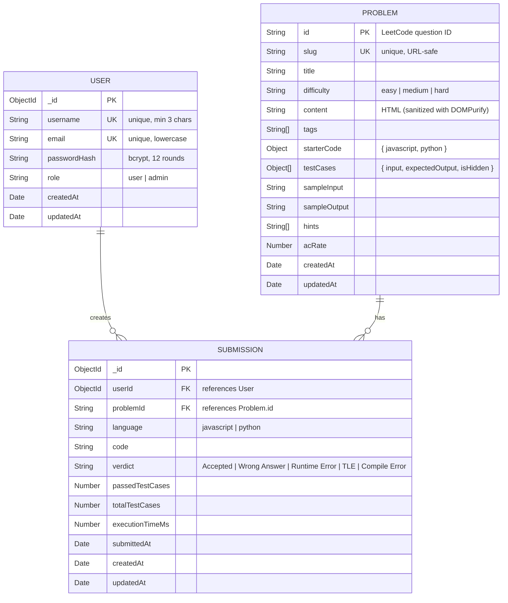

# ER Diagram — Nexorithm Database Schema

## Mermaid Source

## Relationships

| Relationship | Description |
|---|---|
| User → Submission | One user creates many submissions (1:N) |
| Problem → Submission | One problem has many submissions (1:N) |

## Indexes

- `User.username` — unique index
- `User.email` — unique index  
- `Problem.slug` — unique index
- `Submission.userId` — regular index (query by user)
- `Submission.problemId` — regular index (query by problem)

## Notes

- **Password Security**: Passwords are hashed using bcrypt with 12 salt rounds
- **JWT Tokens**: Payload includes `{ userId, username, role }`, expires in 7 days
- **Problem Content**: Stored as raw HTML, sanitized on the frontend using DOMPurify
- **Test Cases**: Embedded subdocuments within Problems (not separate collection)
- **Starter Code**: Embedded object with `javascript` and `python` fields
